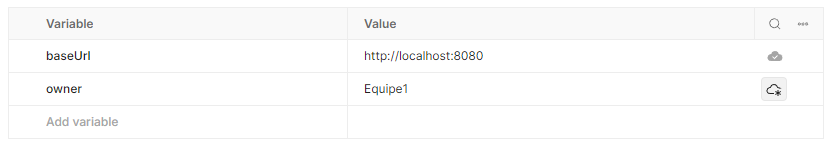
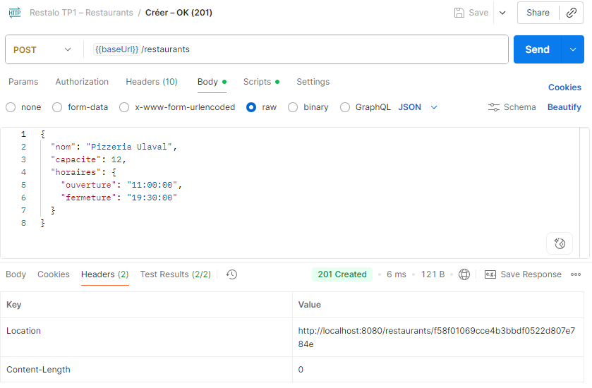
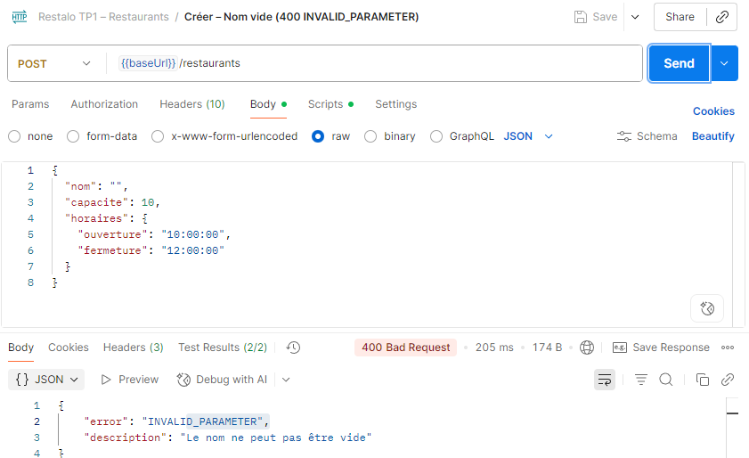
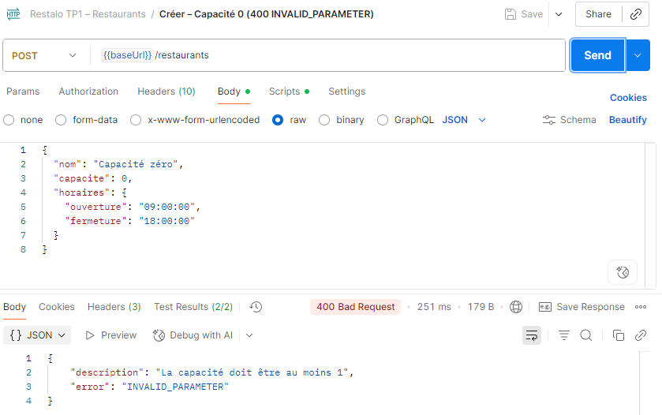
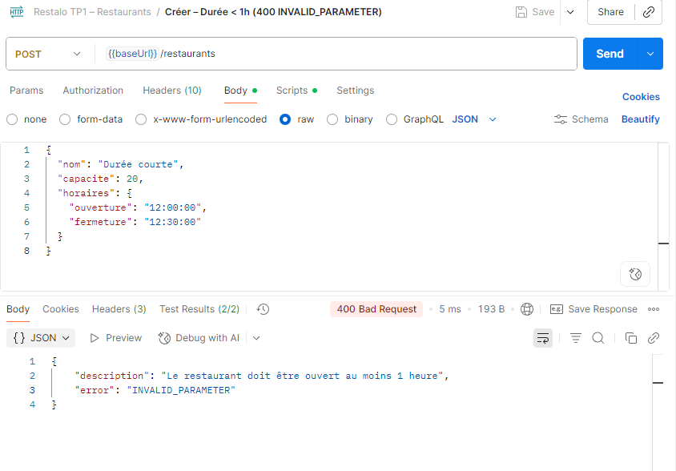
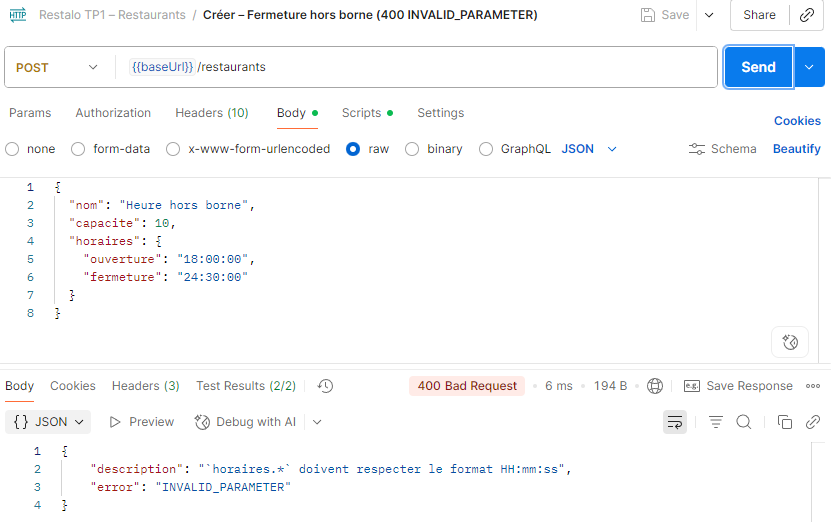
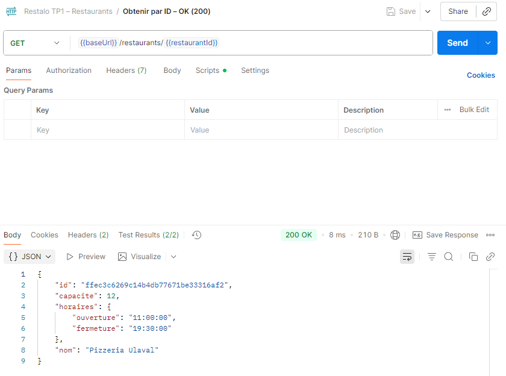
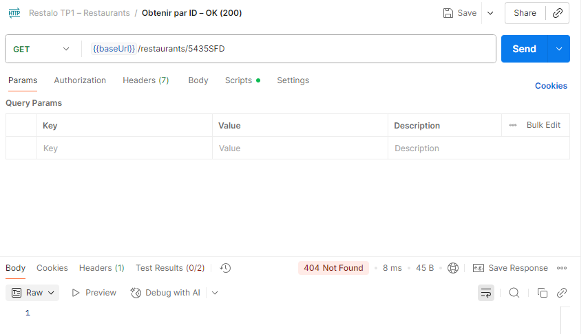
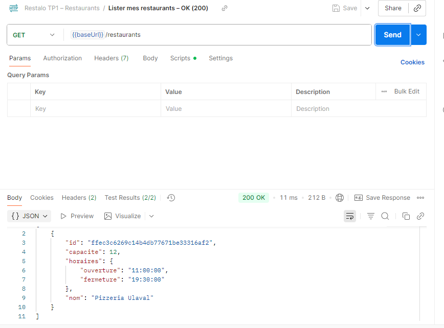
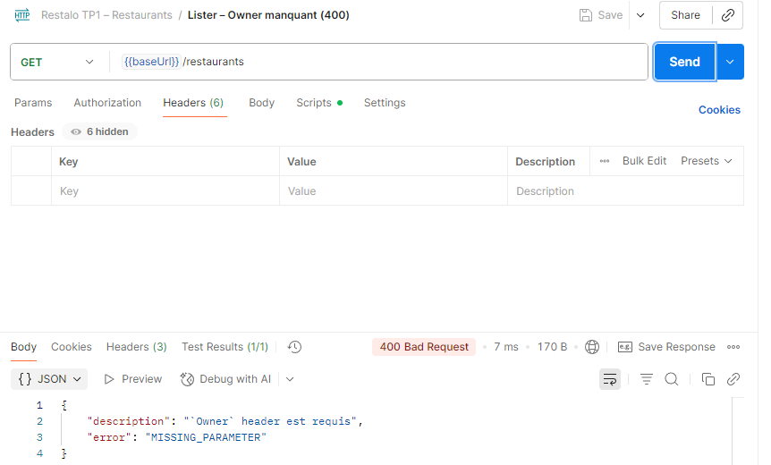

# Exercices - TP1

## Conventions Git
Voici les conventions et stratégies d'utilisations de Git que nous avons décidé d'adopter.

### Nommage et convention concernant les commits
Le commit est le bloc atomic lorsque nous travaillons avec Git. Ainsi, il doit être simple et bref à décrire. 

1) Le titre du commit doit commencer par un verbe a l'infinitif (fix, ajouter, modifier, supprimer, etc.)
2) Le reste du titre doit simplement décrire l'objet ciblé par l'action.
3) Le corps est faculatif. Il doit être utilisé pour ajouter du context au titre. Il ne devrait jamais faire plus de 50 characters. Dans le cas contraire, le commit doit être subdivisé.

Note : le code dans un commit n'a pas besoin d'être correct, ou même de compiler. C'est une étape atomic dans le workflow. L'important, c'est de commit régulièrement. 

Référence : https://cbea.ms/git-commit/#separate

### Stratégie de branchage

1) Une branche par feature. Un developer peut posséder plusieurs branches pour différents features. Cependant, chaque branche est la responsabilité d'un et un seul développeur.
2) Quand un feature est terminé, le developper doit soumettre sont travail sous la forme d'un pull request vers Master. Chaque pull request doit être validé par un autre développeur avant d'être merged.
3) Le Master contient la version stable la plus récente de l'application. Il est donc impératif que le travail mergé dans le Master soit systématiquement révisé et testé.
4) Lorsque l'équipe termine un milestone, une branche ayant l'étiquette correspondante sera créé à partir du Master. Ces branches representes les versions de l'application en production.


Référence : https://githubflow.github.io/

### Utilisation de l'IA

Nous avons utilisé l'outil de synthèse de Google (AI overview) pour simplifier nos recherches web.


---

## 1. Création de restaurant

### Variables d’environnement Postman

Voici les variables que nous avons configurées pour nos requêtes Postman :



### Cas 1 : Création réussie (201 Created)
- **Description** : Création d’un restaurant valide (nom non vide, capacité ≥ 1, horaires corrects).
- **Requête** : `POST /restaurants`
- **Réponse attendue** : `201 Created` + `Location` dans l’en-tête.

📷 Capture :  


---

### Cas 2 : Nom vide (400 INVALID_PARAMETER)
- **Description** : Nom manquant ou chaîne vide.
- **Réponse attendue** :
```json
{ "error": "INVALID_PARAMETER", "description": "Le nom ne peut pas être vide" }
```

📷 Capture :  


---

### Cas 3 : Capacité < 1 (400 INVALID_PARAMETER)
- **Description** : Capacité = 0.
- **Réponse attendue** :
```json
{ "error": "INVALID_PARAMETER", "description": "La capacité doit être au moins 1" }
```

📷 Capture :  


---

### Cas 4 : Durée d’ouverture < 1h (400 INVALID_PARAMETER)
- **Description** : Horaire ouverture/fermeture < 1h d’écart.
- **Réponse attendue** :
```json
{ "error": "INVALID_PARAMETER", "description": "Le restaurant doit être ouvert au moins 1 heure" }
```

📷 Capture :  


---

### Cas 5 : Fermeture hors borne (400 INVALID_PARAMETER)
- **Description** : Fermeture ≥ 24h (ex: "23:59:59" OK, mais pas "24:00:00").
- **Réponse attendue** : `400`.

📷 Capture :  


---

## 2. Consultation d’un restaurant

### Cas 6 : Obtenir par ID (200 OK)
- **Description** : Récupérer un restaurant existant avec son `id`.
- **Requête** : `GET /restaurants/{id}`
- **Réponse attendue** : JSON complet du restaurant.

📷 Capture :  


---

### Cas 7 : Obtenir par ID inexistant (404 NOT_FOUND)
- **Description** : ID inconnu.
- **Réponse attendue** :
```json
{ "error": "NOT_FOUND", "description": "Restaurant non trouvé" }
```

📷 Capture :  


---

## 3. Liste des restaurants

### Cas 8 : Lister mes restaurants (200 OK)
- **Description** : Récupérer tous les restaurants appartenant au propriétaire (header `Owner`).
- **Réponse attendue** : Liste JSON (peut être vide ou contenir plusieurs objets).

📷 Capture :  


---

### Cas 9 : Lister sans Owner (400 MISSING_PARAMETER)
- **Description** : Header `Owner` manquant.
- **Réponse attendue** :
```json
{ "error": "MISSING_PARAMETER", "description": "`Owner` header est requis" }
```

📷 Capture :  


---

## ✅ Conclusion
- Tous les critères de succès ont été validés :
    - ID unique ✔
    - Propriétaire obligatoire ✔
    - Nom non vide ✔
    - Capacité ≥ 1 ✔
    - Ouverture ≥ 1h ✔
    - Heures entre 00:00:00 et 23:59:59 ✔

---
