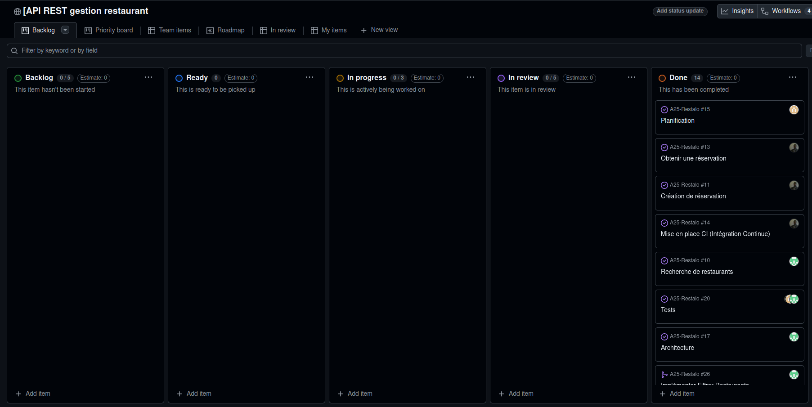
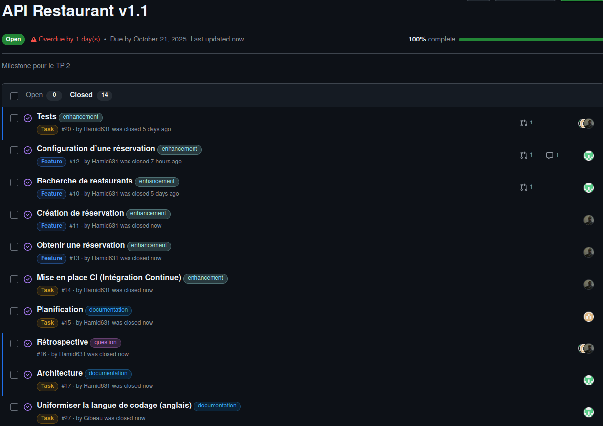
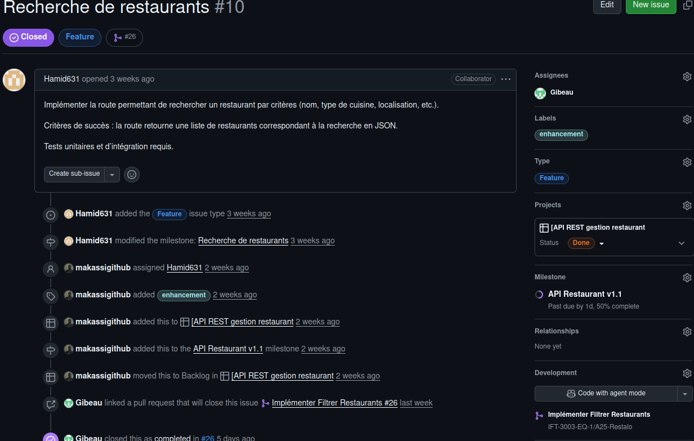
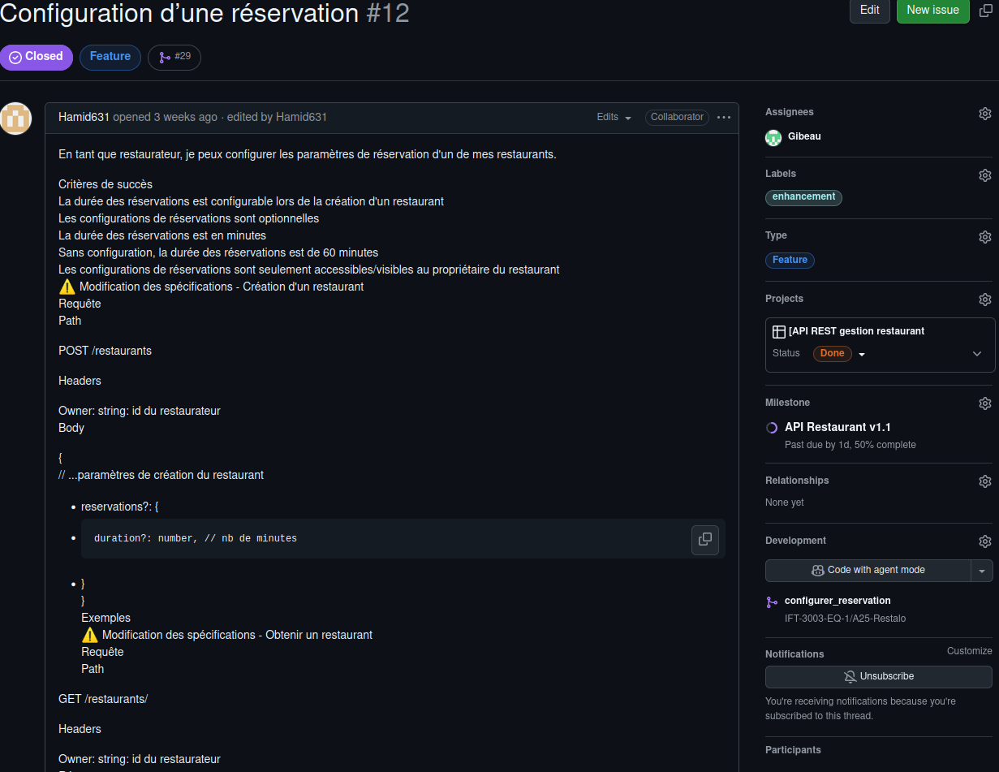
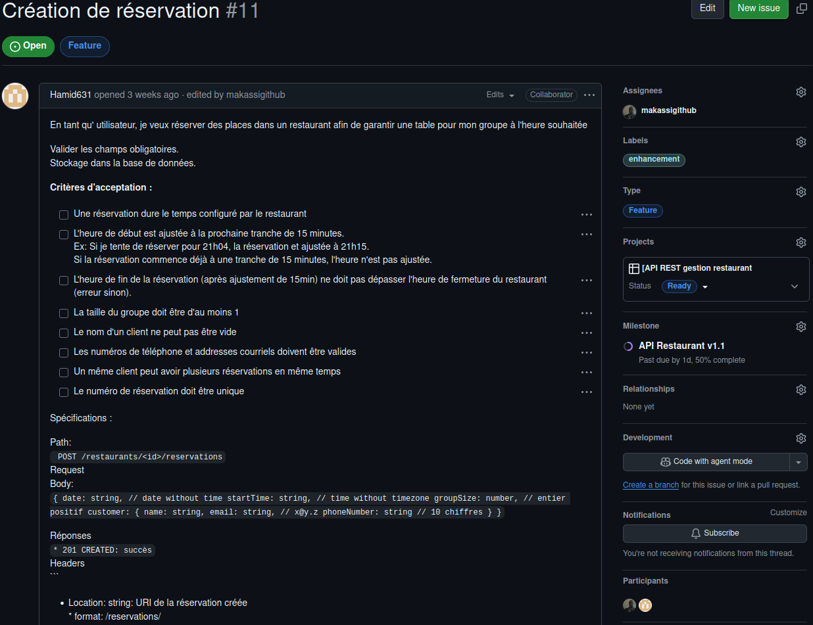
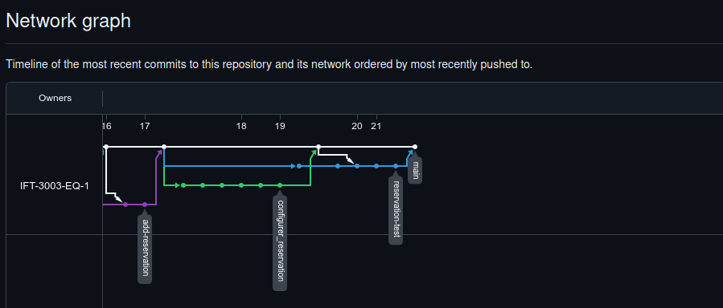

# Exercices - TP2

## Architecture

## Rétrospective

Tout d'abord, veuillez prendre note que l'ensemble du projet a été réalisé par Gabriel Gibeau et Brahima Traore.
Certains éléments de réflexions risques d'être non-applicable considérant nos circonstances.

En moyenne, chaque issue prenait 5 jours à compléter. Le plus court a été la mise en place du CI (moins de 2 jours.)
L'issue le plus long a été la refonte de l'architecture du TP1 (près de 2 semaines.)
Non-seulement le volume de code à écrire était considérable, mais c'était également une tâche névralgique à l'ensemble du projet.

En général, on avait 2 issues en cours d'implémentation à la fois : sois un issue par personne. 
On était chacun responsable de réaliser notre issue, mais la conception et validation était faite de facon collaborative, notamment via des rencontres régulières.

La durée de vie d'une branche variait énormément. Certaines (comme la refonte d'architecture) est restée en vie pendant plus de 2 semaines. D'autres (implémentation du CI) moins de 2 jours.
Évidemment, ceci était directement proportionnel à la taille de la tâche à réaliser. En moyenne, une branche restait en vie pendant une semaine. 5 jours pour réaliser la tache + 2 pour la révision de la PR.

Concernant les PR, nous n'avions jamais plus de 1 PR en attente à la fois, et les PR était généralement merged le lendemain, ou sur-lendemain.
En effet, chaque fois qu'un des deux développeurs terminaient sa partie de code, l'autre la révisait et intégrait les changements à son travail.
Cependant, nous avons tout de même eu à résoudre certains conflits entre nos versions. Par exemple, lorsque nous avons décidé d'uniformiser la langue vers l'anglais. 
La quantité de variable à refactor à générer une quantité appréciable de problème.

De facon général, plus un issue est laborieux, plus il est difficile a merger avec le reste du travail, et plus la branche traine longtemps, en attente d'être merged.
Limiter la taille des issues permait donc de limiter les conflicts de merges.

Concernant les améliorations à apporter à nos méthodes et processus :
1) La gestion du travail d'équipe ce fait présentement via un fils de conversation sur Team. Par exemple, les tâches sont "assignées" via message sur le chat. Il faudrait que le travail de gestion des tâches soit réalisé sur Github via les issues et le kanban.
2) Éviter des tâches de refactoring "globale" (tel que la refonte d'architecture.) Si j'avais à refaire cette tâche, j'essayerais de la compartimenter à une seule route (ex: mettre en place l'architecture pour la fonctionnalité createRestaurant.)
3) Normaliser la couverture des tests. Présentement, chaque développeur déterminait la quantité et le type de tests nécessaire pour atteindre les objectifs de son issue. Pour la prochaine partie du travail, il faudrait établir des normes spécifiques sur quoi et comment tester.

## Utilisation de l'IA

Nous avons utilisé l'outil de synthèse de Google (AI overview) pour simplifier nos recherches web.

## Planification

### Github Project

### Milestone

### Issues

### Pull requests

### Arbre de commits

